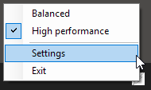
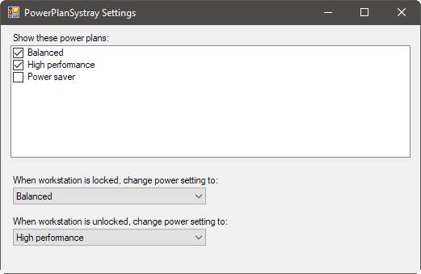

# PowerPlanSystray
Windows system tray utility for easily changing the power plan.

Download it in the [Releases](https://github.com/Ricket/PowerPlanSystray/releases) section.

* Hover your mouse over the system tray icon to quickly see the current power plan.
* Right-click and choose a new power plan, it will be changed immediately.
* In the settings dialog, select power plans to hide from the context menu (e.g. plans you never want to use).
* You can also select a plan that will automatically be activated when the computer is locked and unlocked.

